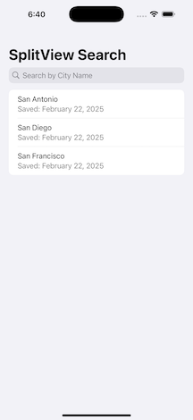

# RYSplitViewSearchExample

## A Sample SwiftUI SplitView App using SwiftData
Basically follows the UX pattern of the Apple's Weather apps for iOS and macOS. Uses root level `NavigationSplitView` with an MVVM architecture. Has a search bar with auto-complete and ability to save searched "Items" using SwiftData. 

### Features
* Swift 6
* SwiftUI using the `@Observable` macro
* SwiftData storage
* MVVM architecture
* iOS, iPadOS, and macOS support
* Swift Testing unit tests

### Preview
](./assets/video/iPhone16ProMaxPortrait.mp4)

### Requires
* Xcode 16.2
* min deployment target:
  * iOS/iPadOS 18.2
  * macOS 15.0 

### Credits
built from sample code derived from:
* https://www.swiftyplace.com/blog/swiftui-search-bar-best-practices-and-examples
* https://www.hackingwithswift.com/quick-start/swiftdata/how-to-use-mvvm-to-separate-swiftdata-from-your-views
* https://developer.apple.com/documentation/swiftui/migrating-from-the-observable-object-protocol-to-the-observable-macro
  
